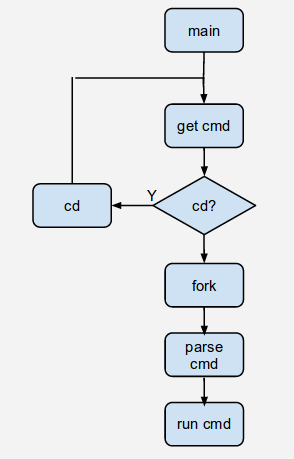
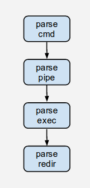
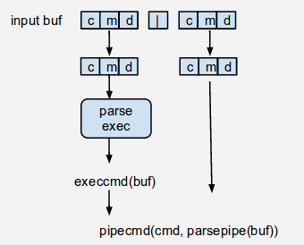
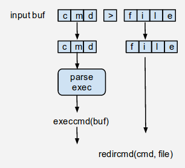

Simple Shell
=====


##Intro

\*nix-like terminal shell, derived from the skeleton of the [xv6 shell](http://pdos.csail.mit.edu/6.828/2012/homework/sh.c).
The skeleton shell contains two main parts: parsing shell commands and run the command in saperate processes. 

The parser recognizes _only_ simple shell commands such as the following:

* ls > y
* cat < y | sort | uniq | wc > y1
* cat y1
* rm y1
* ls | sort | uniq | wc
* rm y


####Limits

MAX AUGUMENTS LIMIT for each single command: 10
MAX LENGTH LIMIT for user input: 100
MAX LENGTH LIMIT for absolute path of command: 100

####Usage

**Only works in *nix-like platform.**

Open your terminal, run the Makefile under the project directory:

```sh
make all
```

Run following to delete the intermediate files and the executable:

```sh
make clean
```

##Impl

####Main Flow


####Parser


####Pipeline


####Redirection



